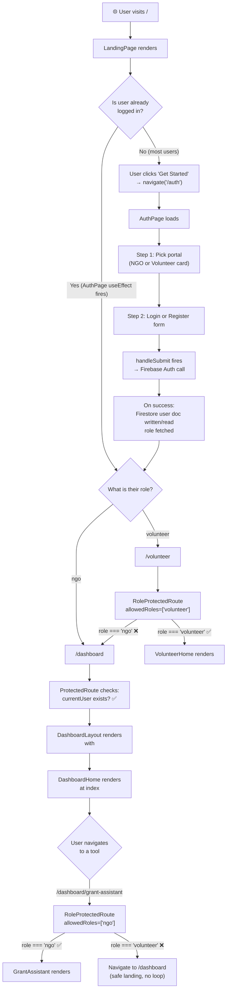

# 🔐 Impact AI — Auth Control Flow Walkthrough

## 🐛 Bug That Was Fixed

`main.jsx` was importing `AuthProvider` from the **old path** after the files were moved:

```diff
- import { AuthProvider } from './components/AuthContext.jsx'
+ import { AuthProvider } from './auth/AuthContext.jsx'
```

This caused a **module-not-found crash**, meaning the entire auth system was dead on load.

---

## The Full Journey: Landing → Auth → Dashboard



---

## Component-by-Component Breakdown

### 1. `main.jsx` — The Root Wrapper

```jsx
<AuthProvider>   // ← wraps EVERYTHING
  <App />
</AuthProvider>
```

`AuthProvider` must be the **outermost wrapper** so every component in the tree can call `useAuth()`. If this import path is wrong, nothing works — which was the bug.

---

### 2. `AuthContext.jsx` — The Global Brain

This is a **React Context** that acts as a shared memory for the whole app.

```
Firebase Auth (onAuthStateChanged)
      │
      ▼
   currentUser  ──────────┐
                           ├──► exposed via useAuth()
   userData (Firestore)  ──┘       to any component
```

**Three states it manages:**

| State | Type | Meaning |
|---|---|---|
| `currentUser` | Firebase User / `null` | Is anyone logged in at all? |
| `userData` | `{ role, fullName, ... }` / `null` | Extra profile data from Firestore |
| `loading` | boolean | Are we still waiting for Firebase to respond? |

**Critical line:**
```jsx
{!loading && children}
```
The entire app is **paused** until Firebase confirms the auth state. This prevents a flash where a logged-in user gets bounced to `/auth` for a split second before the check completes.

---

### 3. `AuthPage.jsx` — The Gateway

Two jobs:

**Job 1 — Already logged in?** Redirect immediately:
```jsx
useEffect(() => {
  if (currentUser && userData) {
    if (userData.role === 'ngo') navigate('/dashboard');
    else if (userData.role === 'volunteer') navigate('/volunteer');
  }
}, [currentUser, userData]);
```

**Job 2 — Handle login/register:**
- Login → `signInWithEmailAndPassword`, then cross-checks role against Firestore to prevent an NGO logging in via the Volunteer portal
- Register → `createUserWithEmailAndPassword` + `setDoc` to write the user's role to Firestore
- On success → navigate to the right dashboard

---

### 4. `ProtectedRoute.jsx` — Layer 1 (Golden Ticket)

```
Question: "Are you logged in AT ALL?"
  YES → let them through
  NO  → redirect to /auth
```

**Wraps:** `/dashboard` (the layout shell)  
**Guards against:** Unauthenticated visitors trying to type `/dashboard` directly into the URL bar.

```jsx
const { currentUser } = useAuth();
if (!currentUser) return <Navigate to="/auth" replace />;
return children;
```

> Note: It only checks `currentUser`. It doesn't care about role. That's Layer 2's job.

---

### 5. `RoleProtectedRoute.jsx` — Layer 2 (Role Check)

```
Question: "Are you logged in AND do you have the right role?"
  Not logged in    → /auth
  Loading userData → show spinner (wait for Firestore)
  Wrong role       → /dashboard (safe home base)
  Correct role     → let them through ✅
```

**Three checks, in order:**
```jsx
// 1. No user at all
if (!currentUser) return <Navigate to="/auth" replace />;

// 2. User data still loading from Firestore
if (!userData) return <Spinner />;

// 3. User has wrong role
if (!allowedRoles.includes(userData.role)) return <Navigate to="/dashboard" replace />;

// All clear
return children;
```

> The spinner on step 2 is crucial. Without it, `userData.role` would be `undefined` for a brief moment, causing everyone to fail the role check.

---

## Route Map Summary

```
/                    → LandingPage              (public)
/auth                → AuthPage                 (public, redirects away if logged in)

/dashboard           → ProtectedRoute           (must be logged in)
  /                  → DashboardHome            (both roles see this)
  /grant-assistant   → RoleProtectedRoute[ngo]  → GrantAssistant
  /email-organizer   → RoleProtectedRoute[ngo]  → DonorEmailOrganizer
  /volunteer-matcher → RoleProtectedRoute[ngo]  → VolunteerMatcher
  /event-scheduler   → RoleProtectedRoute[ngo]  → EventSchedulerAI
  /impact-report     → RoleProtectedRoute[vol]  → ImpactReporter

/volunteer           → RoleProtectedRoute[vol]  → VolunteerHome
```

---

## Why `/dashboard` Uses `ProtectedRoute` (Not `RoleProtectedRoute`)

This is the key architectural decision. If you put `RoleProtectedRoute allowedRoles={['ngo']}` on `/dashboard`:

```
Volunteer navigates to /grant-assistant
  → RoleProtectedRoute says "wrong role, go to /dashboard"
  → /dashboard also says "wrong role, go to /dashboard"
  → 💥 Infinite redirect loop
```

By using `ProtectedRoute` on the shell, `/dashboard` becomes a **safe landing pad** for any logged-in user. The role checks happen only on the individual tool routes.
